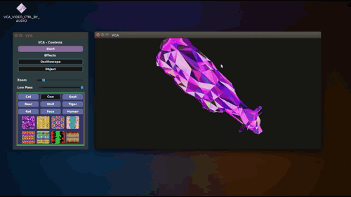

# VCA - Video Controlled by Audio

> Developed at Turin in Italy in 2019 - Re-upload

VCA is a software that was used in nightclubs for the video projection of 3D objects (here animals) and oscilloscopic visuals animated according to the bass of the music. 

The software consists of two windows. One for window for controlling the parameters and another window for viewing the video stream. 

The control window allows you to change :

- the 3D object
- The texture
- The zoom on the object
- The cut-off frequency of the low pass filter

## Models

- Oscilloscope
- Cat
- Cow
- Goat
- Deer
- Wolf
- Tiger
- Rat
- Face
- Human

Combined with 8 textures :small_airplane:

## Install

1. Install the [Juce IDE](https://juce.com/)

2. Open the `VCA_VIDEO_CTRL_BY_AUDIO.jucer` File
3. Compile it with Juce

## Licence

- MIT
